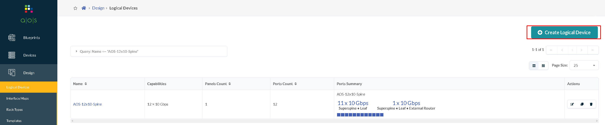

# Create vQFX AOS Logical Model (AOS-12x10-Spine)



## API POST (create) 
```bash
cat <<EOT >> /tmp/design_logical-devices_AOS-12x10-Spine.json
{
      
      "panels": [
        {
          "panel_layout": {
            "row_count": 1,
            "column_count": 12
          },
          "port_indexing": {
            "order": "T-B, L-R",
            "start_index": 1,
            "schema": "absolute"
          },
          "port_groups": [
            {
              "count": 11,
              "speed": {
                "unit": "G",
                "value": 10
              },
              "roles": [
                "superspine",
                "leaf"
              ]
            },
            {
              "count": 1,
              "speed": {
                "unit": "G",
                "value": 10
              },
              "roles": [
                "superspine",
                "leaf",
                "external_router"
              ]
            }
          ]
        }
      ],
      "display_name": "AOS-12x10-Spine",
       "id": "AOS-12x10-Spine"
}
EOT

```
```bash
curl  -H "AuthToken: $token"  -k -X POST "https://10.10.10.5/api/design/logical-devices" -H  "accept: application/json" -H  "content-type: application/json" -d @/tmp/design_logical-devices_AOS-12x10-Spine.json
```
