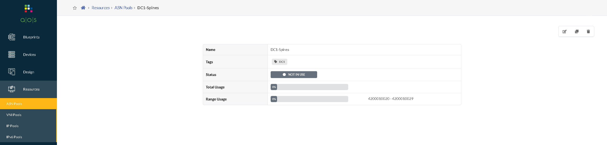

# ASN
A 4-byte ASN is a 32-bit number.<br>
ANA reserved a block of 94,967,295 ASNs (4200000000 to 4294967294) for private use.<br>
Source: https://www.arin.net/resources/guide/asn/<br>
<br>
Syntax:<br>
42 XXXX YYYY<br>
XXXX = DC1<br>
YYYY = Device ID<br>


## ASNs – Spines (ID 20-29)


### API POST (create) 
```bash
cat <<EOT > /tmp/resources_asn-pools_DC1-Spines.json
{
      "id": "asn_dc1_spines",
      "display_name": "DC1-Spines",
      "tags": [
        "DC1"
      ],
      "ranges": [
        {
          "status": "pool_element_available",
          "first": 4200010020,
          "last": 4200010029
        }
      ]
    }
EOT
```

```bash
curl  -H "AuthToken: $token" \
  -k -X POST "https://$apstra_ip/api/resources/asn-pools" \
  -H  "accept: application/json" \
  -H  "content-type: application/json" \
  -d @/tmp/resources_asn-pools_DC1-Spines.json
```


## ASNs – Leafs (ID 30-99)


### API POST (create) 
```bash
cat <<EOT > /tmp/resources_asn-pools_DC1-Leafs.json
{
      "id": "ans_dc1_leafs",
      "display_name": "DC1-Leafs",
      "tags": [
        "DC1"
      ],
      "ranges": [
        {
          "status": "pool_element_available",
          "first": 4200010030,
          "last": 4200010099
        }
      ]
    }
EOT
```

```bash
curl -H "AuthToken: $token" \
  -k -X POST "https://$apstra_ip/api/resources/asn-pools" \
  -H  "accept: application/json" \
  -H  "content-type: application/json" \
  -d @/tmp/resources_asn-pools_DC1-Leafs.json
```
