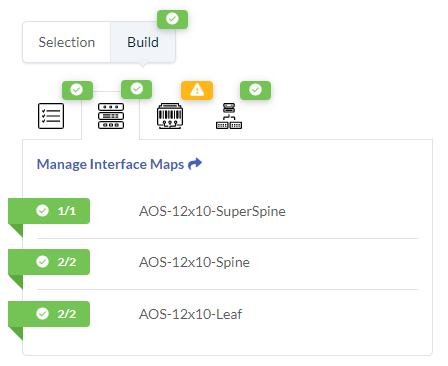

# Blueprint Update Device Profiles



Set variable with name of Blueprint ID
```bash
export blueprint_id=DC1
```


## Print Device System IDs
```bash
curl -s -H "AuthToken: $token" \
  -k -X GET "https://$apstra_ip/api/blueprints/$blueprint_id/cabling-map" \
  -H  "accept: application/json" \
  -H  "content-type: application/json"  | jq -r '.links[].endpoints[].system | .id +" "+ (.role) +" " + (.label)' | column |  sort | uniq | sort -k3 > /tmp/cabling_map.csv
```

## Update Device Profile Interface Map Assignments
```bash
declare -A role_mapping
role_mapping["superspine"]="Juniper_vQFX__AOS-12x10-SuperSpine"
role_mapping["spine"]="Juniper_vQFX__AOS-12x10-Spine"
role_mapping["leaf"]="Juniper_vQFX__AOS-12x10-Leaf"

cabling_map_file="/tmp/cabling_map.csv"
while IFS=$' ' read -r system_id role system_name; do
  curl -s -H "AuthToken: $token" \
    -k -X PATCH "https://$apstra_ip/api/blueprints/$blueprint_id/interface-map-assignments" \
    -H  "accept: application/json" \
    -H  "content-type: application/json" \
    -d  '{ "assignments": { "'${system_id}'": "'${role_mapping[${role}]}'" } }'
done < "$cabling_map_file"
```